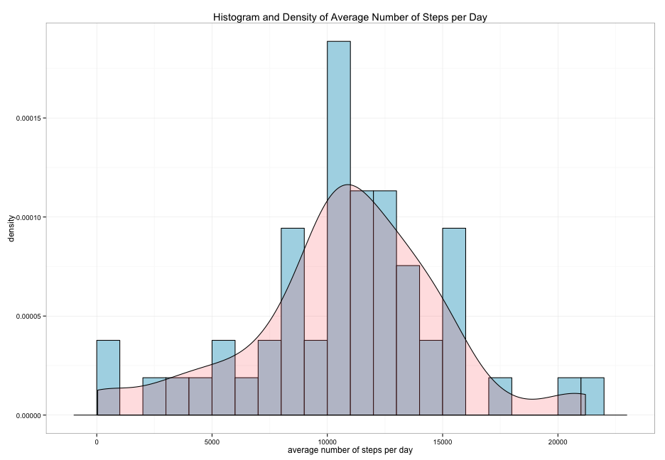
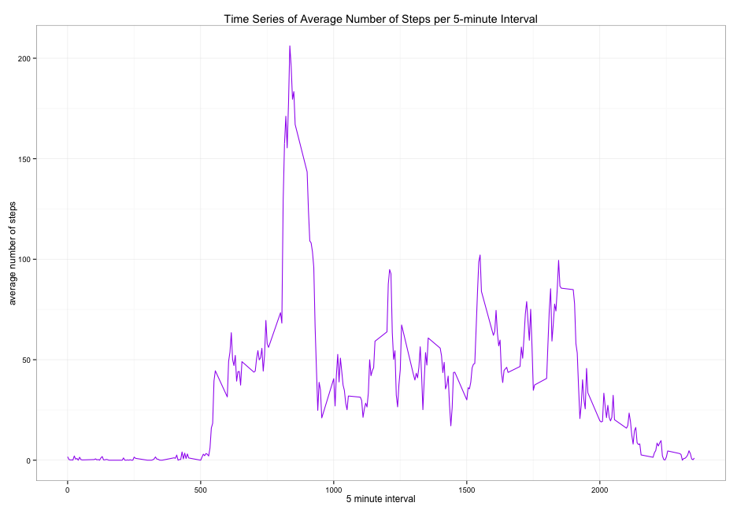
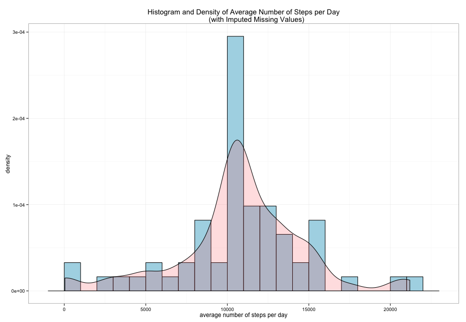
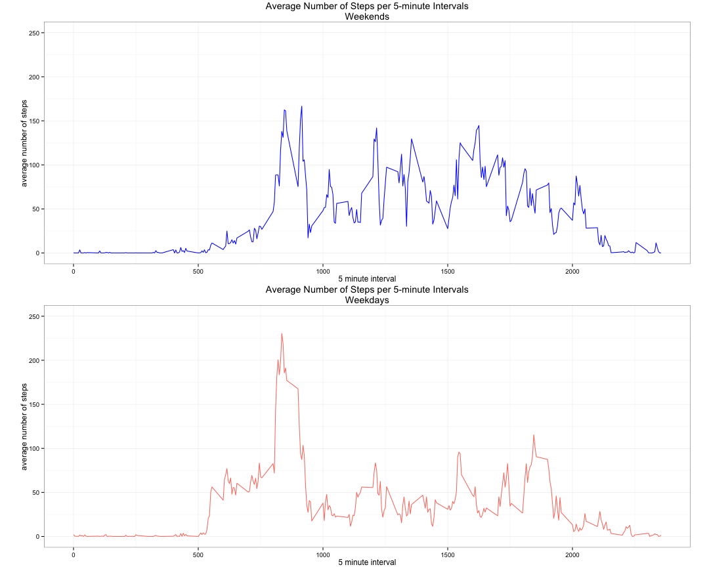

library(knitr)
knit2html("PA1_template.Rmd")

---
**Analysis of Activity Monitoring Data**
---
John Slough II

13 Jan 2015

**Report**

A histogram with density curve of the average number of steps taken per day is shown below.

```r
setwd("~/Desktop/Git/Coursera-Reproducible-Research/Project1")

activity=read.csv("activity.csv",header=TRUE)
activity$date=as.Date(activity$date)

library(plyr)
byDay=ddply(activity,"date",summarize, sum=sum(steps))

meanDay=round(mean(byDay$sum,na.rm=TRUE))
medianDay=median(byDay$sum,na.rm=TRUE)
```

```r
library(ggplot2)

ggplot(byDay, aes(x=sum))+ 
        geom_histogram(aes(y=..density..),binwidth=1000,
        colour="black", fill="lightblue") +
        geom_density(alpha=.2, fill="#FF6666")+
        labs(title="Histogram and Density of Average Number of Steps per Day")+
        labs(x="average number of steps per day",y="density")
```

```
## Warning: Removed 8 rows containing non-finite values (stat_density).
```

 

The mean and median number of steps per day are 10766 and 10765 respectively.  

**Average Daily Activity Pattern**

The following plot is a time series of the 5-minute interval and the average number of steps taken, averaged across all days.  


```r
byInt=ddply(activity,"interval",summarize, avg=mean(steps,na.rm=TRUE))

ggplot(byInt, aes(x = interval, y = avg, group = 1))+
         geom_line(colour="purple")+ 
        labs(title="Time Series of Average Number of Steps per 5-minute Interval")+
        labs(x="5 minute interval",y="average number of steps")
```

 

```r
which.max(byInt[,2])
```

```
## [1] 104
```

```r
maxInt=round(byInt[104,])
byIntSort=byInt[order(byInt[,2],decreasing=TRUE),]
```

The interval which contains the maximum average number of steps taken is interval 835 for a maximum average of 206 number of steps.  

**Imputing Missing Values**


```r
miss=sum(is.na(activity))
n=nrow(activity)
prop=round(sum(is.na(activity))/nrow(activity)*100,1)
```
The total number of missing values in the dataset is 2304 which corresponds to 13.1% of the data.  
To fill in the missing data I will replace the missing value with the mean of the corresponding 5-minute interval for that missing value.  This is done with the packages 'plyr' and 'Hmisc'.  


```r
library(Hmisc)
```

```
## 
## Attaching package: 'Hmisc'
## 
## The following object is masked from 'package:survey':
## 
##     deff
## 
## The following objects are masked from 'package:xtable':
## 
##     label, label<-
## 
## The following objects are masked from 'package:plyr':
## 
##     is.discrete, summarize
## 
## The following objects are masked from 'package:base':
## 
##     format.pval, round.POSIXt, trunc.POSIXt, units
```

```r
# create new dataset with imputed values
activity.imputed = ddply(activity, "interval", mutate, 
                         imputed.steps = impute(steps, mean))

act.imp.order=activity.imputed[order(activity.imputed[,2],decreasing=FALSE),]

activity.imp=act.imp.order[,c(4,2,3)]
activity.imp$imputed.steps=as.integer(activity.imp$imputed.steps)
detach("package:Hmisc")
```

A histogram with density curve of the new dataset with imputed missing values is shown below.


```r
byDay.imp=ddply(activity.imp,"date",summarize, sum=sum(imputed.steps))

ggplot(byDay.imp, aes(x=sum)) +theme_set(theme_bw())+ 
        geom_histogram(aes(y=..density..),binwidth=1000,
        colour="black", fill="lightblue") +
        geom_density(alpha=.2, fill="#FF6666")+
        labs(title="Histogram and Density of Average Number of Steps per Day
             (with Imputed Missing Values)")+
        labs(x="average number of steps per day",y="density")
```

 

```r
mean.imp=round(mean(byDay.imp$sum,na.rm=TRUE))
median.imp=median(byDay.imp$sum,na.rm=TRUE)
```

The mean and median number of steps per day from the new dataset are 10750 and 10641 respectively.  These values do differ from the estimates from the original dataset by 16 and 124 for the means and medians, respectively.  From the histogram it appears that replacing the missing values with the means of that 5-minute interval have concentrated the average total number of steps per day around 10000 steps.  

**Differences in activity patterns between weekdays and weekends**

 The following plot, created by making a new factor variable for weekend and weekdays was created to show different activity patterns between these two factors.  
 


```r
# create factor variable for Weekend vs. Weekday
activity.imp$wend = as.factor(ifelse(weekdays(activity.imp$date) %in% 
        c("Saturday","Sunday"), "Weekend", "Weekday")) 

activity.WE=subset(activity.imp,wend=="Weekend")
activity.WD=subset(activity.imp,wend=="Weekday")

byWE.imp=ddply(activity.WE,"interval",summarize, avg=mean(imputed.steps))
byWD.imp=ddply(activity.WD,"interval",summarize, avg=mean(imputed.steps))
library(gridExtra)

ggWE=ggplot(byWE.imp, aes(x = interval, y = avg, group = 1))+ylim(0,250)+
        geom_line(colour="blue")+ 
        labs(title="Average Number of Steps per 5-minute Intervals\nWeekends")+
        labs(x="5 minute interval",y="average number of steps")
ggWE=ggWE+theme(plot.margin=unit(c(0,1,0,1), "cm"))

ggWD=ggplot(byWD.imp, aes(x = interval, y = avg, group = 1))+ylim(0,250)+
        geom_line(colour="salmon")+ 
        labs(title="Average Number of Steps per 5-minute Intervals\nWeekdays")+
        labs(x="5 minute interval",y="average number of steps")
ggWD=ggWD+theme(plot.margin=unit(c(0,1,0,1), "cm"))

grid.arrange(ggWE, ggWD, nrow=2, ncol=1)
```

 


We can clearly see that there is a higher spike in number of steps for the weekdays however, it appears that the number of steps is higher throughout the day for weekends.
