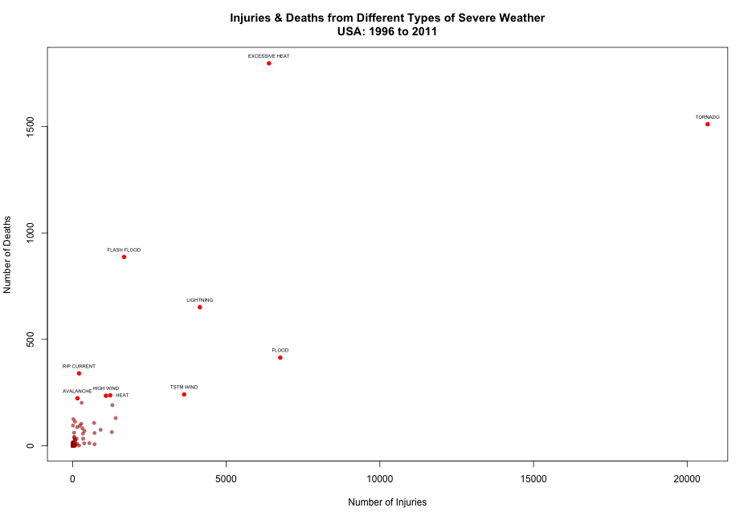
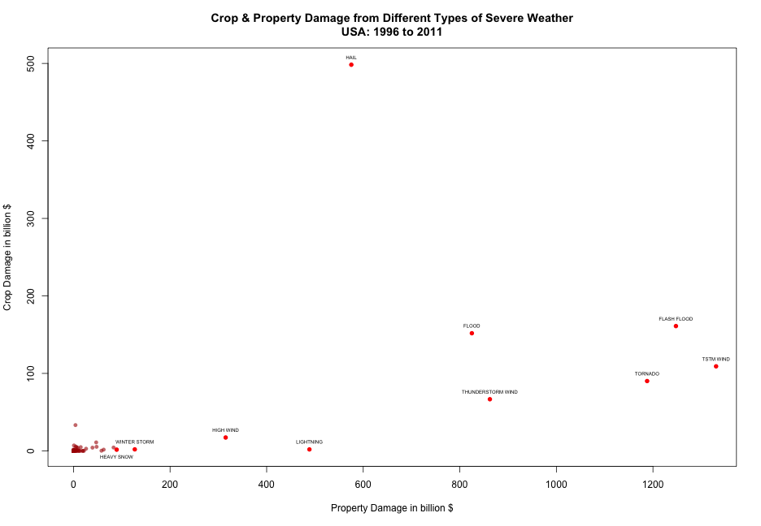
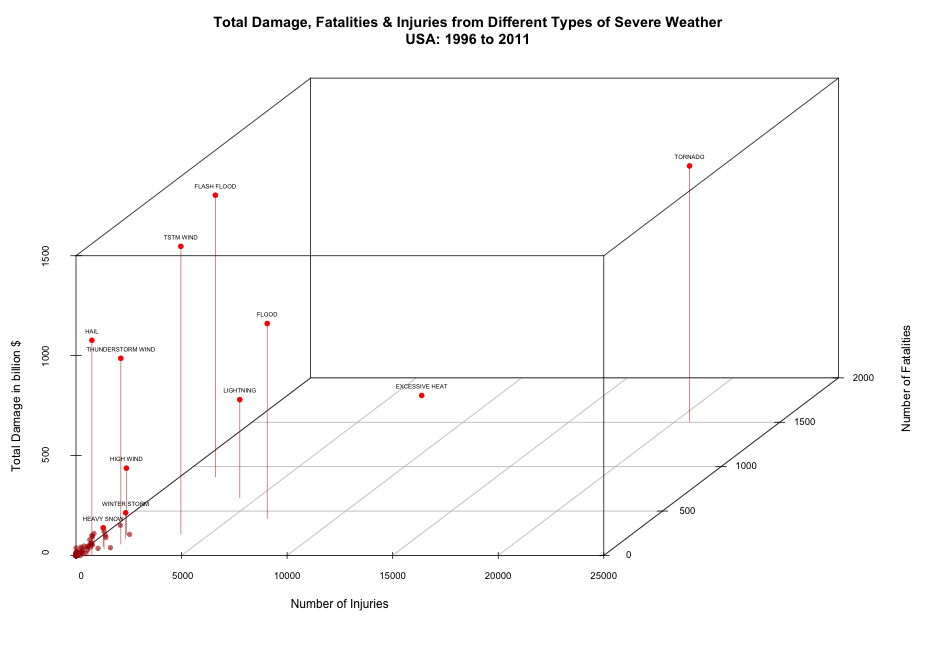

**John Slough II**

21 Jan 2015

---
**An Analysis of Severe Weather and Its Economic and Population Health Consequences**
---


**Synopsis**

Severe weather event data and its economic and public health consequences was analyzed to determine which events were most harmful with respect to population health and which types of events have the greatest economic consequences.  From analysis of the data from 1996 to 2011, it was determined that excessive heat, tornadoes and floods have the worst consequences in terms of public health.  Tstm wind, flash flood, tornadoes, and hail are among the worst in terms of economic consequences. 


**Data**

The data analyzed comes from the U.S. National Oceanic and Atmospheric Administration's (NOAA) storm database.  The dataset is a collection of severe weather events and their economic and population health consequences from 1950 to 2011 in the USA.  We are to determine which kind of severe weather has the most effect on the economy and public health.   

**Data Processing**


A feature of the data is that until 1996 all severe weather events were not recorded; prior to 1996 only tornado, thunderstorm wind, and hail were recorded and prior to 1955 only tornadoes were recorded.  This means that if were used the entire dataset the results would be biased towards tornado, thunderstorm wind, and hail.  Therefore, only the data from 1996 onwards will be analyzed.  See http://www.ncdc.noaa.gov/stormevents/details.jsp?type=eventtype for more information.
The code chunk below first loads the raw csv file, subsets only the required columns and writes a new csv file.  This is to aid processing speed, as the raw file requires a lot of time to process.
The BGN_DATE variable is converted to date format, then all records from 1996 onwards are selected.


```r
setwd("~/Desktop/Coursera/Reproducible Research/project2")

# the following code, now set as comments, needs to be run the first time the 
# dataset is loaded
#stormAll=read.csv("repdata_data_StormData.csv",header=TRUE)
#storm=subset(storm,select=c(BGN_DATE, STATE,EVTYPE,FATALITIES,
#                           INJURIES,PROPDMG,CROPDMG))
# write smaller file, load for subsequent analysis
#write.csv(storm, file = "storm.csv",row.names=FALSE)
storm=read.csv("storm.csv",header=TRUE)
storm$BGN_DATE = as.Date(storm$BGN_DATE, "%Y-%m-%d")
AllET=subset(storm, BGN_DATE>"1995-12-31") 
```


**Results of Population Health Analysis**

The number of fatalities and injuries were recorded.  Severe weather events in which there were more than 0 fatalities or injuries were selected for analysis.
The top 10 severe weather types based on number of fatalities, then injuries is shown in the code chunk below.


```r
FatInj = subset(AllET, FATALITIES>0 |INJURIES>0,
                  select=c(EVTYPE,FATALITIES,INJURIES))

library(plyr)
Fatsum=ddply(FatInj,"EVTYPE", summarize,fatalities=sum(FATALITIES))
Injsum=ddply(FatInj,"EVTYPE", summarize,injuries=sum(INJURIES))
FatInjCount=merge(Injsum,Fatsum,all.x=TRUE)
FatInjCountSort=FatInjCount[order(c(FatInjCount$fatalities),decreasing=TRUE),]
FatInjCountSortInj=FatInjCount[order(c(FatInjCount$injuries),decreasing=TRUE),]

FatInjCountSort[1:10,]
```

```
##             EVTYPE injuries fatalities
## 26  EXCESSIVE HEAT     6391       1797
## 115        TORNADO    20667       1511
## 34     FLASH FLOOD     1674        887
## 78       LIGHTNING     4141        651
## 35           FLOOD     6758        414
## 92     RIP CURRENT      209        340
## 118      TSTM WIND     3629        241
## 49            HEAT     1222        237
## 64       HIGH WIND     1083        235
## 1        AVALANCHE      156        223
```

```r
FatInjCountSortInj[1:10,]
```

```
##                EVTYPE injuries fatalities
## 115           TORNADO    20667       1511
## 35              FLOOD     6758        414
## 26     EXCESSIVE HEAT     6391       1797
## 78          LIGHTNING     4141        651
## 118         TSTM WIND     3629        241
## 34        FLASH FLOOD     1674        887
## 112 THUNDERSTORM WIND     1400        130
## 134      WINTER STORM     1292        191
## 67  HURRICANE/TYPHOON     1275         64
## 49               HEAT     1222        237
```
We can see almost the same weather types in the top ten for each sorting method.  It is clear that excessive heat, tornadoes, and floods are among the worst in both sets.  

To visualize this data a scatterplot of the number of injuries and fatalities from severe weather was produced.  The top ten types of severe weather are highlighted.  The two worst, by a large margin are tornadoes and excessive heat.  One may like to note that flood and flash flood are both high and may be similar occurrences however the NOAA has distinguished them as separate types.  


```r
top=FatInjCountSort[c(1:7,9,10),]
heat=FatInjCountSort[8,]
library(calibrate)

plot(FatInjCountSort$injuries,FatInjCountSort$fatalities,cex=.9,xlim=c(0,20500),ylim=c(0,1800),
     col=rgb(100,0,0,90,maxColorValue=150), pch=16,xlab="Number of Injuries",ylab="Number of Deaths",
     main="Injuries & Deaths from Different Types of Severe Weather\nUSA: 1996 to 2011")
par(new=TRUE)
plot(top$injuries,top$fatalities,xlim=c(0,20500),ylim=c(0,1800),xaxt='n',yaxt='n',bty='n',ylab='',xlab='',col=rgb(100,0,0,maxColorValue=100),pch=16)
textxy(top$injuries,top$fatalities, top$EVTYPE, cex= 0.5,pos=3)
par(new=TRUE)
plot(heat$injuries,heat$fatalities,xlim=c(0,20500),ylim=c(0,1800),xaxt='n',yaxt='n',bty='n',ylab='',xlab='',col=rgb(100,0,0,maxColorValue=100),pch=16)
textxy(heat$injuries,heat$fatalities, heat$EVTYPE, cex= 0.5,pos=4)
```

 


**Results of Economic Consequences Analysis**

The dataset includes data on crop and property damage for each severe weather event.  Severe weather events in which there were more than $0 crop or property damage were selected for analysis.
The top 10 severe weather types based on property damage, then crop damage is shown in the code chunk below.


```r
EconDam = subset(AllET, PROPDMG>0 |CROPDMG>0,
                 select=c(EVTYPE,PROPDMG,CROPDMG))

Propsum=ddply(EconDam,"EVTYPE", summarize,property=sum(PROPDMG))
Cropsum=ddply(EconDam,"EVTYPE", summarize,crop=sum(CROPDMG))
PropCropSum=merge(Propsum,Cropsum,all.x=TRUE)
# change from million to billion $ for plots
PropCropSum$property=PropCropSum$property/1000
PropCropSum$crop=PropCropSum$crop/1000
PropCropSort=PropCropSum[order(PropCropSum$property,PropCropSum$crop,decreasing=TRUE),]
PropCropSortcrop=PropCropSum[order(PropCropSum$crop,PropCropSum$property,decreasing=TRUE),]

PropCropSort[1:10,]
```

```
##                EVTYPE   property      crop
## 152         TSTM WIND 1330.70691 109.11060
## 44        FLASH FLOOD 1247.56254 161.06671
## 148           TORNADO 1187.87823  90.12850
## 145 THUNDERSTORM WIND  862.25736  66.66300
## 46              FLOOD  824.93671 151.82618
## 72               HAIL  575.31728 498.33912
## 109         LIGHTNING  488.56185   1.90344
## 86          HIGH WIND  315.09806  17.26821
## 181      WINTER STORM  126.91049   1.96399
## 77         HEAVY SNOW   89.39311   1.59170
```

```r
PropCropSortcrop[1:10,]
```

```
##                EVTYPE   property      crop
## 72               HAIL  575.31728 498.33912
## 44        FLASH FLOOD 1247.56254 161.06671
## 46              FLOOD  824.93671 151.82618
## 152         TSTM WIND 1330.70691 109.11060
## 148           TORNADO 1187.87823  90.12850
## 145 THUNDERSTORM WIND  862.25736  66.66300
## 30            DROUGHT    4.09405  33.29362
## 86          HIGH WIND  315.09806  17.26821
## 75         HEAVY RAIN   47.00284  10.97771
## 59       FROST/FREEZE    0.96852   7.03414
```
Again, we can see similar severe weather types in the top ten for each sorting method.  

As above, to visualize this data a scatterplot of the crop damage and property damage from severe weather was produced.  The top ten types of severe weather are highlighted.  We can see that hail produces, by far, the most crop damage.  The worst as far as property damage appears to be wind related events (tornadoes, thunderstorm winds) and floods/flash floods.  


```r
topdam=PropCropSort[1:9,]
topdamHSnow=PropCropSort[10,]

p=plot(PropCropSort$property,PropCropSort$crop,cex=.9,xlim=c(0,1320),
       ylim=c(0,500),col=rgb(100,0,0,90,maxColorValue=150), pch=16,
       xlab="Property Damage in billion $",ylab="Crop Damage in billion $",
     main="Crop & Property Damage from Different Types of Severe Weather\nUSA: 1996 to 2011")
par(new=TRUE)
plot(topdam$property,topdam$crop,xlim=c(0,1320),ylim=c(0,500),xaxt='n',
     yaxt='n',bty='n',ylab='',xlab='',col=rgb(100,0,0,maxColorValue=100),
     pch=16)
textxy(topdam$property,topdam$crop, topdam$EVTYPE, cex= 0.5,pos=3)
par(new=TRUE)
plot(topdamHSnow$property,topdamHSnow$crop,xlim=c(0,1320),ylim=c(0,500),
     xaxt='n',yaxt='n',bty='n',ylab='',xlab='',
     col=rgb(100,0,0,maxColorValue=100),pch=16)
textxy(topdamHSnow$property,topdamHSnow$crop, topdamHSnow$EVTYPE, 
       cex= 0.5,pos=1)
```

 


**Overall Results**

In order to have a better idea of the overall consequences of severe weather events property damage and crop damage were combined in one variable called total damage.  As it does not seem prudent to combine the population health variables injury and fatality the following analysis will keep them separate.  
A 3-D scatterplot was created using these three variables.   The number of injuries is shown on the x axis, the number of fatalities on the z axis, and the total damage in billion dollars on the y axis.  Lines are drawn from the top ten severe weather events for total damage and they are labeled. Clearly, tornadoes are the worst single severe weather event for total damage and population health, as they result in the highest or almost the highest value for each variable.  Floods/flash floods are also stand out.  Excessive heat leads to high levels of fatalities but virtually 0 property or crop damage.  
 


```r
PropCropSumTotal=PropCropSum
PropCropSumTotal$total=PropCropSumTotal$property+PropCropSumTotal$crop
AllCount=merge(PropCropSumTotal,FatInjCount,all=TRUE)

AllCount[is.na(AllCount)] = 0
AllCountSort=AllCount[order(AllCount$fatalities,AllCount$total,AllCount$injuries,decreasing=TRUE),]

All10=AllCount[order(AllCount$total,decreasing=TRUE),][1:10,]
ExHeat=AllCount[which(AllCount$EVTYPE=="EXCESSIVE HEAT"),] 
All10=rbind(All10,ExHeat)
library(scatterplot3d)

sp3D=scatterplot3d(AllCountSort$injuries,AllCountSort$fatalities,
                   AllCountSort$total,color=rgb(100,0,0,90,maxColorValue=150),
                   pch=16,xlab="Number of Injuries", 
              ylab="Number of Fatalities", zlab="Total Damage in billion $",
              main="Total Damage, Fatalities & Injuries from Different Types of Severe Weather\nUSA: 1996 to 2011",
              highlight.3d=FALSE,type="h")
sp3D$points3d(x=All10$injuries,y=All10$fatalities,z=All10$total,
              col=rgb(100,0,0,maxColorValue=100),pch=16)
sp3D.coords = sp3D$xyz.convert(All10$injuries,All10$fatalities,All10$total)
text(sp3D.coords$x, sp3D.coords$y, labels=All10$EVTYPE, cex=.5, pos=3) 
```

 

**Conclusion**


Policy makers may use this analysis to better prioritize resources in order deal with the consequences of these severe weather events.  By knowing which severe weather events produce the most, and which types of damage, resources can be directed in a more efficient manner.  
